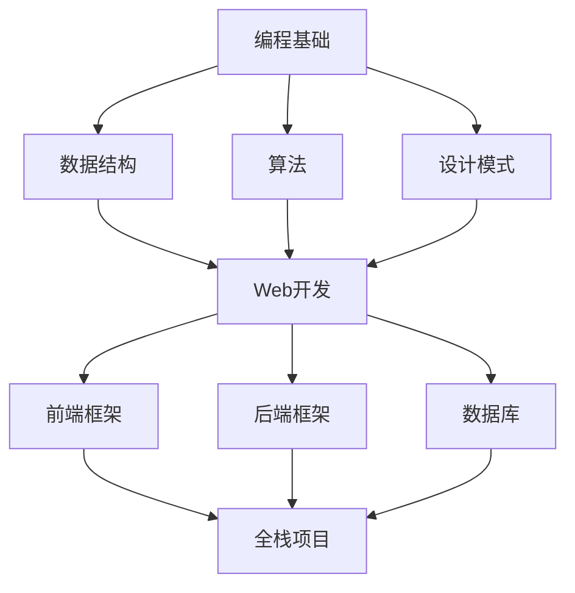

## 初识编程

还记得第一次接触编程是在大学的计算机基础课上。那时候对着黑底白字的命令行窗口，看着老师敲下 `print("Hello World")`，屏幕上出现了那行文字，我突然意识到——原来代码就是和计算机对话的语言。

那种感觉就像打开了一扇通往新世界的大门。从那一刻起，我就被编程深深吸引了。

## 艰难的起步阶段

### 第一个困境：语法迷宫

刚开始学习 Python 的时候，我最头疼的就是记住各种语法规则。什么时候用冒号，什么时候用括号，缩进到底有多重要... 每次运行代码都会遇到各种 `SyntaxError`。

记得有一次，为了找到一个缩进错误，我足足调试了两个小时。当我最后发现只是少了一个空格时，既沮丧又觉得有些好笑。

> 现在回想起来，那些看似愚蠢的错误，其实是成长的必经之路。
{: .prompt-tip }

### 突破点：做一个真实项目

转折点出现在我决定做第一个真实项目的时候——一个简单的待办事项应用。虽然功能很基础，但这让我第一次完整地经历了从需求分析、设计、编码到测试的全过程。

```python
# 我的第一个待办事项应用（核心代码片段）
class TodoList:
    def __init__(self):
        self.tasks = []
    
    def add_task(self, task):
        self.tasks.append({
            'content': task,
            'completed': False
        })
        print(f"✓ 已添加任务: {task}")
    
    def complete_task(self, index):
        if 0 <= index < len(self.tasks):
            self.tasks[index]['completed'] = True
            print(f"✓ 已完成: {self.tasks[index]['content']}")
```

这个项目虽然简陋，但让我建立了极大的信心。**原来我真的可以创造出有用的东西！**

## 进阶之路

### 拥抱开源社区

在学习的第二年，我开始尝试为开源项目做贡献。第一次提交 Pull Request 时，手都在抖。但当我的代码被合并，看到自己的名字出现在贡献者列表中时，那种成就感难以言表。

开源社区教会了我：
- 如何阅读别人的代码
- 如何写出更规范的代码
- 如何与其他开发者协作
- 如何处理代码评审的反馈

### 全栈开发的挑战

从后端转向全栈开发是我面临的又一个挑战。学习前端框架（React、Vue）时，我发现自己又回到了初学者的状态——面对满屏的 JSX 和各种 Hooks，完全不知道从何下手。

{: .shadow }
_在咖啡馆里敲代码的日子_

但这次我已经有了经验：

1. **系统学习基础知识** - 先理解 JavaScript ES6+ 的核心概念
2. **动手做项目** - 跟着官方文档做了好几个小项目
3. **阅读优秀代码** - 学习业界优秀项目的代码结构
4. **写技术博客** - 把学到的知识整理成文章，加深理解

## 我的学习方法论

经过这几年的学习，我总结出了自己的一套方法：

### 1. 费曼学习法

> 如果你不能简单地解释一个概念，说明你还没有真正理解它。
{: .prompt-info }

每学完一个知识点，我都会尝试用自己的话讲给别人听（或者写成博客）。这个过程会暴露出我理解不透彻的地方。

### 2. 刻意练习

不要只停留在舒适区。我会专门挑战自己不擅长的领域，比如：
- 算法和数据结构
- 系统设计
- 性能优化

### 3. 构建知识体系

我维护着自己的知识库，使用思维导图和笔记工具（Obsidian）把零散的知识点连接起来，形成体系。



### 4. 保持好奇心

技术日新月异，保持对新技术的好奇心和学习热情很重要。但不要盲目追新，要有选择地学习真正有价值的技术。

## 踩过的坑

### ❌ 教程地狱

曾经有段时间，我沉迷于看各种教程视频，但就是不动手写代码。结果发现自己看懂了一切，但真正写代码时还是一头雾水。

**教训**：看教程要配合实践，比例至少是 1:2（看1小时，练2小时）。

### ❌ 完美主义陷阱

做项目时总想着要做到完美才能发布，结果很多项目都烂尾了。

**教训**：先做出 MVP（最小可行产品），然后不断迭代优化。Done is better than perfect.

### ❌ 单打独斗

曾经觉得自己一个人也能学好编程，后来发现有一个良好的社区和导师是多么重要。

**教训**：积极参与技术社区，找到志同道合的伙伴，寻求前辈的指导。

## 给初学者的建议

如果你也在编程学习的路上，我想分享几点建议：

1. **不要害怕犯错** - 每一个bug都是学习的机会
2. **多动手少空想** - 实践是检验真理的唯一标准
3. **建立学习习惯** - 每天写代码，哪怕只有30分钟
4. **记录你的成长** - 写技术博客是最好的学习方式之一
5. **相信时间的力量** - 编程能力的提升需要时间积累，不要急于求成

> 编程不是天赋的游戏，而是坚持的艺术。
{: .prompt-warning }

## 未来的规划

现在的我，已经可以独立完成全栈项目的开发。但学习的旅程远未结束：

- 📚 深入学习云原生技术（Docker、Kubernetes）
- 🔧 提升系统架构设计能力
- 🌐 探索 Web3 和区块链技术
- ✍️ 持续输出技术文章，分享知识
- 🤝 为更多开源项目做贡献

## 结语

回顾这段编程之旅，我最大的感悟是：**编程改变了我看待世界的方式**。它不仅是一门技能，更是一种思维方式——如何将复杂问题分解、如何设计优雅的解决方案、如何持续优化和迭代。

如果你也在考虑开始学习编程，我想告诉你：**现在就是最好的时机**。不要等到准备好了才开始，因为你永远不会完全准备好。Just start coding!

最后，感谢在这段旅程中帮助过我的每一个人——老师、朋友、开源社区的前辈们。也希望我的经历能给正在路上的你一些启发和鼓励。

让我们一起，在编程的世界里不断探索、成长！💪

---

_如果你也有类似的经历或者想要交流学习心得，欢迎在评论区留言！_

