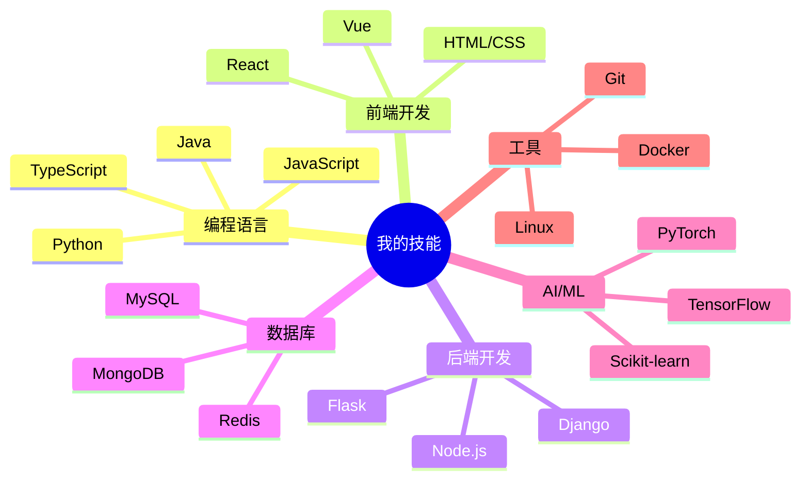

## 研究方向

我的主要研究兴趣集中在以下几个领域：

### 🤖 人工智能与机器学习

- **深度学习**：神经网络架构设计与优化
- **自然语言处理**：文本分析、语言模型
- **计算机视觉**：图像识别与处理

### 🌐 Web 开发与系统架构

- **全栈开发**：前后端分离架构设计
- **微服务架构**：分布式系统设计与实现
- **性能优化**：Web 应用性能分析与优化

### 📊 数据科学

- **数据分析**：统计分析与数据挖掘
- **数据可视化**：交互式可视化工具开发
- **大数据处理**：分布式数据处理框架

---

## 研究项目

### 项目一：智能推荐系统

**时间**：2024.01 - 2024.06

**描述**：基于深度学习的个性化推荐系统，使用协同过滤和内容推荐相结合的方法。

**技术栈**：Python, TensorFlow, Flask, Redis

**成果**：
- 提升推荐准确率 15%
- 发表会议论文 1 篇

### 项目二：全栈 Web 应用开发

**时间**：2023.06 - 2024.01

**描述**：开发了一个现代化的全栈 Web 应用，包含用户管理、数据分析、实时通信等功能。

**技术栈**：React, Node.js, MongoDB, WebSocket

**成果**：
- 部署上线，服务 1000+ 用户
- 开源项目，获得 50+ stars

---

## 论文与出版物

> 此部分将持续更新...
{: .prompt-info }

---

## 技能树

---

## 联系我

如果你对我的研究感兴趣，或者想要合作交流，欢迎通过以下方式联系我：

- 📧 Email: prc@tongji.edu.cn
- 💻 GitHub: [Prongcan](https://github.com/Prongcan)
- 🔗 LinkedIn: [peirongcan](https://www.linkedin.com/in/peirongcan)

